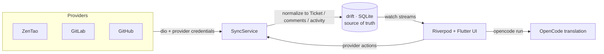

# WorkNexus

**One place to read and act on every ticket.** WorkNexus is a local-first macOS
workspace for developers who work across **ZenTao, GitLab, and GitHub**. It syncs
provider data into a local SQLite read model, normalizes it as `Ticket`, and then
shows each source with the workflow it actually uses: ZenTao bugs/tasks, GitLab
issues/MRs, and GitHub issues/PRs.

<sub>🇬🇧 English · <a href="README.vi.md">🇻🇳 Tiếng Việt</a></sub>

> **Status:** early development · macOS desktop · private project. Built with
> Flutter/Dart on a feature-first Clean Architecture.

---

## Why WorkNexus?

Work often lives in several trackers at once. WorkNexus gives you one desktop
surface for triage, reading, filtering, commenting, provider actions, attachment
preview, and machine translation without jumping between several browser tabs.

- **Local-first.** drift/SQLite is the single source of truth. Network sync writes
  into the database; the Flutter UI reads reactive streams from the database, so
  cached tickets keep working offline.
- **Unified, not flattened.** All sources become `Ticket`s, but each board keeps
  provider-native lifecycle columns and actions instead of forcing every provider
  through one generic status model.
- **Secure by default.** Credentials are stored with `flutter_secure_storage`
  (macOS Keychain). Authenticated media loads attach tokens only to the provider
  host, not to arbitrary third-party asset/CDN hosts.

---

## Features

### Unified source tree and board

- Workspace-grouped sidebar with multiple provider accounts per company.
- Source-specific boards:
  - ZenTao product bug boards and execution task boards.
  - GitLab project boards plus an account-wide **My merge requests** board.
  - GitHub repository boards plus an account-wide **My pull requests** board.
- Pinned projects/repos/executions stay at the top of each provider tree.
- Kanban and List views over the same normalized `Ticket` data.
- Provider-native columns:
  - ZenTao bugs: new/unconfirmed, confirmed/to-fix, resolved/verify,
    postponed, non-fix, closed.
  - ZenTao tasks: not started, in progress, paused, done/verify, closed,
    canceled.
  - GitLab/GitHub issues: open, in progress, closed.
  - GitLab/GitHub MRs/PRs: draft, review, merged, closed.
- Context-aware filters with data-derived facets for workspace, provider,
  account, assignee, status, priority, labels, and search.
- Server-side slices with offline fallback: when a selected tab/project/repo
  cannot refresh, cached tickets still render from the local database.

### Multi-provider connections

| Provider | Auth | Data / scopes | In-app actions |
|---|---|---|---|
| **ZenTao** | Login/password in Keychain; app mints the v1 session token | Bugs by product, tasks by execution | Comment, internal note, assign, confirm/resolve/activate bugs, pin products/executions |
| **GitLab** | Personal Access Token | Issues, merge requests, project members, labels, milestones, commits/changes for MRs | Comment, internal note, assign, close/reopen, request reviewers, approve/rebase/merge MRs, edit labels/milestone/time tracking |
| **GitHub** | Personal Access Token | Issues, pull requests, repo assignees/reviewers, commits/files for PRs | Comment, internal note, assign, close/reopen, request reviewers, update branch, merge PRs |

GitLab works with `gitlab.com` and self-hosted instances. GitHub works with
`github.com` and GitHub Enterprise Server. Jira is currently a UI/asset
placeholder; no Jira adapter is implemented yet.

### Task detail and review views

- Standard slide-over detail panel with **Original**, selected translation
  target, and **Comments & Activity** tabs.
- Two detail layouts: a two-pane metadata sidebar or a single-column document
  reading mode.
- Provider comments and local-only internal notes in one timeline.
- Secure inline image loading plus attachment preview for repro screenshots and
  videos.
- Dedicated GitLab MR and GitHub PR views with overview, activity composer,
  commits, changed files, merge state, and metadata editors.

### Machine translation

- Uses the local **OpenCode CLI** via `opencode run`; authenticate OpenCode with
  `opencode auth login`.
- Default target language is Vietnamese, with selectable targets for English,
  Japanese, Simplified Chinese, and Korean.
- Translation records are cached per ticket, target language, source hash, and
  prompt template version.
- State is explicit: `none`, `loading`, `done`, `outdated`, or `error`.
- Prompts preserve code, identifiers, file paths, URLs, and Markdown.

### Appearance and workflow settings

- Full English/Vietnamese UI localization.
- Quick settings for UI language, translation target language, theme, surface
  style, density, detail layout, date format, font, accent color, and component
  radius.
- Themes: light, dark, and midnight.
- Surface variants: flat or outline; density variants: comfortable or compact.
- Default UI font: **Be Vietnam Pro** via `google_fonts`.
- Bundled fonts: **Space Grotesk** and **Space Mono**; optional system fonts and
  **Geist Mono** are selectable.
- Resizable sidebar width is persisted in drift.

### Experimental coding-agent dispatch

The codebase includes a Development-tab implementation for dispatching a ticket
to **Claude Code**, **Codex**, or **OpenCode**. It defaults to dry-run mock
sessions; live CLI mode uses locally installed binaries and streams normalized
events into an in-memory session store. This workflow is still experimental and
is not part of the default detail tab strip yet.

---

## Tech Stack

| Area | Choice |
|---|---|
| Language / UI | Flutter 3.38.8 · Dart 3.10.7 (via **fvm**) |
| State management | **Riverpod 3** with immutable **freezed** state |
| Dependency injection | **get_it** + **injectable** in one composition root |
| Local database | **drift** / SQLite with reactive `.watch()` streams |
| Networking | **dio** + **retrofit** for typed REST clients |
| Error handling | **fpdart** `Result` / `Failure`; layer boundaries do not throw |
| Secrets | **flutter_secure_storage** backed by the macOS Keychain |
| Desktop shell | **window_manager** custom title bar |
| UI / media | **gpt_markdown**, **flutter_svg**, **cached_network_image**, **video_player**, **image_picker**, **google_fonts** |
| Logging / diagnostics | **talker_flutter**, **talker_dio_logger**, **logger** |
| Codegen | **build_runner**, **freezed**, **json_serializable**, **drift_dev**, **retrofit_generator**, **injectable_generator**, **flutter_gen** |

---

## Architecture

WorkNexus follows a **feature-first Clean Architecture**: features are vertical
slices with `domain -> data -> presentation`, dependencies point inward, and
domain objects stay pure Dart. The single composition root is `lib/core/di/`.
The current repo still keeps shared drift repositories under `lib/data/local/`
while feature ownership is being tightened. The full rulebook lives in
[`AGENTS.md`](AGENTS.md) / [`CLAUDE.md`](CLAUDE.md).



```
lib/
├── app/                 # Root app widget, shell, title bar, sidebar host
├── core/                # Shared kernel: theme, widgets, error, di, database, util
├── data/local/          # Shared drift-backed repositories and mappers
├── features/
│   ├── agents/          # Dry-run/live CLI agent adapters and session streams
│   ├── board/           # Unified source tree, board/list views, board use cases
│   ├── connections/     # Provider setup and provider-specific adapters
│   ├── sync/            # Provider -> drift sync, actions, secure media cache
│   ├── task_detail/     # Slide-over detail, comments, actions, MR/PR views
│   └── translation/     # OpenCode-backed translation service and state
├── gen/                 # Generated asset accessors
└── l10n/                # English/Vietnamese ARB files and generated l10n
```

---

## Getting Started

### Prerequisites

- **[fvm](https://fvm.app/)** with Flutter **3.38.8** / Dart **3.10.7**.
- **macOS** with Xcode command-line tools (primary desktop target).
- Provider credentials:
  - ZenTao server URL, account, and password.
  - GitLab Personal Access Token, usually with `api` scope.
  - GitHub Personal Access Token for the repos/orgs you want to read and act on.
- Optional:
  - `opencode` authenticated with `opencode auth login` for machine translation.
  - `claude`, `codex`, or `opencode` on `PATH` for experimental live agent
    dispatch.

### Setup

```bash
# 1. Install dependencies
make get

# 2. Generate freezed/json/drift/retrofit/injectable/flutter_gen output
make codegen

# 3. Run the app on macOS
make run
```

Then open **Settings -> Integrations** in the app, connect a provider account,
and choose a source from the sidebar.

### macOS Notes

- The macOS app sandbox is intentionally off so WorkNexus can spawn local CLI
  tools and access local OpenCode/agent processes.
- Credentials are stored in the login Keychain, not in the local database.
- For stable Keychain access across rebuilds, add a local
  `macos/Runner/Configs/Signing.xcconfig` based on
  `macos/Runner/Configs/Signing.xcconfig.example`. Without it, builds fall back
  to ad-hoc signing.

---

## Make Targets

| Target | What it does |
|---|---|
| `make doctor` | Show Flutter diagnostics |
| `make get` | Install Dart/Flutter dependencies |
| `make outdated` | Show dependency upgrade information |
| `make codegen` | Run all code generators once |
| `make watch` | Watch and regenerate generated Dart sources |
| `make run` | Run the app (`DEVICE=macos` by default) |
| `make format` | Format `lib` and `test` |
| `make analyze` | Run static analysis |
| `make test` | Run tests (`TEST=path/or/name` targets a subset) |
| `make verify` | Run `format`, `analyze`, and `test` |
| `make build-macos` | Build the macOS app |
| `make build-macos-release` | Build the macOS release app |
| `make build-windows-release` | Build the Windows release app target |
| `make build-linux-release` | Build the Linux release app target |
| `make clean` | Clean Flutter build output |
| `make reset` | Clean, reinstall dependencies, and regenerate code |

Run `make help` to list the current targets.

---

## Testing

The test suite covers domain board logic, provider normalization/adapters,
drift repositories and migrations, caches, theme extensions, quick settings,
provider badges, connection dialogs, MR/PR detail views, and translation state.

```bash
make test
make test TEST=test/domain/translation_languages_test.dart
make test TEST=test/data/github_adapter_test.dart
```

---

## Roadmap

- [x] ZenTao provider: bugs by product, tasks by execution.
- [x] GitLab provider: issues/MRs, project boards, and My MRs.
- [x] GitHub provider: issues/PRs, repo boards, and My PRs.
- [x] Provider comments plus local-only internal notes.
- [x] OpenCode machine translation with multiple target languages.
- [x] GitLab/GitHub MR/PR detail views with commits, changed files, and merge
  actions.
- [ ] Surface and polish the coding-agent Development workflow.
- [ ] Persist dev links and agent sessions beyond the current in-memory store.
- [ ] Jira adapter.
- [ ] Validate Windows/Linux desktop targets.
- [ ] Client/server sync split and mobile clients.

---

## License

Private project — © 2026 com.worknexus. All rights reserved.
