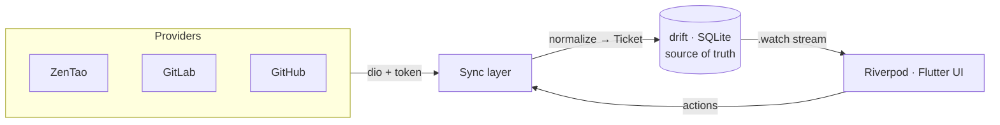

# WorkNexus

**One board for every ticket.** A local-first developer workspace that pulls bugs,
tasks, stories, issues, merge/pull requests from **ZenTao, GitLab, and GitHub** into a
single **Unified Task Board** — with built-in Vietnamese translation and one-click
dispatch of a ticket to a local coding agent (`claude`, `codex`, `opencode`).

<sub>🇬🇧 English · <a href="README.vi.md">🇻🇳 Tiếng Việt</a></sub>

> **Status:** early development · macOS desktop · private project.
> Built with Flutter/Dart on a feature-first Clean Architecture.

---

## Why WorkNexus?

Modern teams scatter their work across multiple trackers. WorkNexus aggregates them
into one keyboard-friendly desktop app so you can triage, filter, translate, comment,
and act on tickets without tab-hopping between four different web UIs.

- **Local-first.** A local SQLite database (drift) is the single source of truth. The
  UI always reads from the DB and reacts to changes; sync writes the network into the
  DB, never straight into the screen. Everything stays fast and works offline once
  synced.
- **Provider-agnostic board.** ZenTao, GitLab, and GitHub items are normalized into one
  `Ticket` model and shown side by side — Kanban or List.
- **Secure by default.** Provider tokens live in the macOS Keychain, never in plain
  text. Auth headers are attached per-host so a token never leaks to a third-party
  image/CDN host.

---

## Features

### 📋 Unified Task Board
- **Kanban and List** views over a normalized `Ticket` model.
- Per-provider board modes: ZenTao **Bugs** / **Tasks**, GitLab **Issues** / **MRs**,
  GitHub **Issues** / **PRs**.
- **Context-aware filters** with a sensible "**My tickets**" default, plus data-derived
  facets (assignee, status, priority, labels…).
- Server-driven browse tabs for ZenTao bug boards (**All / Unclosed**).

### 🔌 Multi-provider connections
| Provider | Auth | Items | In-app actions |
|---|---|---|---|
| **ZenTao** *(primary)* | Token | Bugs, Tasks (by product / execution) | Resolve / activate bug, assign, comment, pin executions |
| **GitLab** | Personal Access Token | Issues, Merge Requests | Close / reopen / merge, assign |
| **GitHub** | Personal Access Token | Issues, Pull Requests | Close / reopen / merge PR, assign |

Works with both SaaS (`gitlab.com`, `github.com`) and **self-hosted / Enterprise**
instances.

### 🗂️ Task Detail slide-over
A focused panel with tabs: **Original · Translation · Comments · Activity ·
Development** — including inline image/attachment preview (repro screenshots and
videos) fetched securely with your token.

### 🌐 Vietnamese translation (built-in)
Translate a ticket's description and comments to Vietnamese via a local **OpenCode**
backend (`opencode serve`). Results are cached with clear states —
*none / loading / done / outdated / error* — so you never re-translate unchanged text.

### 🤖 Dispatch to a coding agent
Hand a ticket to a locally-installed CLI agent — **`claude`**, **`codex`**, or
**`opencode`** — to start working on it directly from the board.

### 🎨 Editorial design system
- Three surfaces: **light editorial cream**, **dark**, **midnight**.
- **Flat / outline** variants × **comfortable / compact** density × optional
  **company accent tint** × adjustable component radius.
- Bundled **Space Grotesk** + **Space Mono** typefaces.
- Full **English / Vietnamese** UI (l10n).

---

## Tech stack

| Area | Choice |
|---|---|
| Language / UI | Flutter · Dart 3.10.7 (managed via **fvm**) |
| State management | **Riverpod 3** (immutable state via **freezed**) |
| Dependency injection | **get_it** + **injectable** (single composition root) |
| Local database | **drift** (SQLite) — reactive `.watch`, source of truth |
| Networking | **dio** + **retrofit** (type-safe ZenTao REST client) |
| Error handling | **fpdart** `Result` / `Failure` (no exceptions across layers) |
| Secrets | **flutter_secure_storage** (macOS Keychain) |
| Desktop shell | **window_manager** (custom title bar) |
| Markdown / media | **gpt_markdown**, **cached_network_image**, **video_player** |

---

## Architecture

WorkNexus follows a **feature-first Clean Architecture**: every feature is a vertical
slice with `domain → data → presentation`, dependencies point inward only, and the
`domain` layer is pure Dart. The full, enforced rulebook lives in
[`AGENTS.md`](AGENTS.md) / [`CLAUDE.md`](CLAUDE.md).



```
lib/
├── app/                 # Root widget + app shell
├── core/                # Shared kernel: theme, widgets, error, di, database, util…
├── features/
│   ├── agents/          # Dispatch tickets to coding-agent CLIs
│   ├── board/           # Unified Task Board (domain + presentation)
│   ├── connections/     # Provider setup: ZenTao / GitLab / GitHub
│   ├── sync/            # Network → drift sync
│   ├── task_detail/     # Task Detail slide-over
│   └── translation/     # OpenCode-backed VI translation
└── l10n/                # EN / VI localization
```

---

## Getting started

### Prerequisites
- **[fvm](https://fvm.app/)** (the toolchain is pinned; commands run as `fvm flutter` /
  `fvm dart`) with **Flutter 3.38.8 / Dart 3.10.7**.
- **macOS** with Xcode command-line tools (current desktop target).
- Optional, for their respective features:
  - **OpenCode** on your `PATH` (Vietnamese translation).
  - `claude` / `codex` / `opencode` CLIs on your `PATH` (dispatch to coding agent).

### Setup

```bash
# 1. Install dependencies
make get            # → fvm flutter pub get

# 2. Generate code (freezed / json / drift / retrofit / injectable)
make codegen        # → build_runner build --delete-conflicting-outputs

# 3. Run the app on macOS
make run            # → fvm flutter run -d macos
```

Then open **Settings → Integrations** in the app to connect a provider (ZenTao token,
or a GitLab/GitHub Personal Access Token) and sync your first board.

### macOS notes
- The app sandbox is intentionally **off** so it can spawn local CLI agents and reach
  `localhost` (the OpenCode server). Tokens are stored in the **login keychain** (no
  special entitlement required).
- For stable Keychain access across rebuilds, add a local
  `macos/Runner/Configs/Signing.xcconfig` (see `Signing.xcconfig.example`). Without it,
  builds fall back to ad-hoc signing.

---

## Make targets

| Target | What it does |
|---|---|
| `make get` | Install dependencies |
| `make codegen` | Run all code generators once |
| `make watch` | Watch & regenerate generated sources |
| `make run` | Run the app (`DEVICE=macos` by default) |
| `make format` | Format `lib` + `test` |
| `make analyze` | Static analysis |
| `make test` | Run tests (`TEST=path/or/name` to target a subset) |
| `make verify` | `format` + `analyze` + `test` |
| `make build-macos-release` | Build the macOS release app |
| `make reset` | Clean, reinstall deps, regenerate code |

Run `make help` to list everything.

---

## Testing

Domain logic (entities, value objects, use cases) is testable without Flutter; the data
boundary is mocked with **mocktail** and repositories are tested against an in-memory
drift database.

```bash
make test                                   # full suite
make test TEST=test/data/zentao_normalize_test.dart   # a single file
```

---

## Roadmap

- [x] ZenTao provider (bugs + tasks)
- [x] GitLab provider (issues + merge requests)
- [x] GitHub provider (issues + pull requests)
- [x] Vietnamese translation via OpenCode
- [x] Dispatch tickets to coding agents
- [ ] Push comments back to providers
- [ ] Additional providers (e.g. Jira)
- [ ] iOS / Android clients
- [ ] Client ↔ server sync split

---

## License

Private project — © 2026 com.worknexus. All rights reserved.
