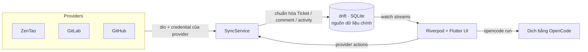

# WorkNexus

**Một nơi để đọc và xử lý mọi ticket.** WorkNexus là workspace desktop theo
hướng local-first trên macOS, dành cho developer phải theo dõi công việc ở nhiều
nguồn như **ZenTao, GitLab và GitHub**. App đồng bộ dữ liệu về SQLite cục bộ,
chuẩn hóa thành `Ticket`, rồi hiển thị theo đúng luồng làm việc của từng nguồn:
bug/task ZenTao, issue/MR GitLab, issue/PR GitHub.

<sub><a href="README.md">🇬🇧 English</a> · 🇻🇳 Tiếng Việt</sub>

> **Trạng thái:** đang phát triển giai đoạn đầu · desktop macOS · dự án nội bộ.
> Viết bằng Flutter/Dart theo Clean Architecture feature-first.

---

## Vì sao có WorkNexus?

Công việc thường nằm rải rác ở nhiều hệ thống quản lý khác nhau. WorkNexus gom
việc đọc ticket, lọc, triage, bình luận, thao tác với provider, xem tệp đính kèm
và dịch máy vào một giao diện desktop duy nhất, để bạn không phải liên tục đổi
qua lại giữa nhiều tab trình duyệt.

- **Local-first.** drift/SQLite là nguồn dữ liệu chính. Sync ghi dữ liệu mạng
  vào CSDL; UI Flutter đọc stream reactive từ CSDL, nên ticket đã được cache vẫn
  xem được khi offline.
- **Thống nhất nhưng không đánh đồng.** Mọi nguồn đều được chuẩn hóa thành
  `Ticket`, nhưng từng bảng vẫn giữ vòng đời và action riêng của provider thay
  vì ép tất cả vào một bộ trạng thái chung.
- **An toàn mặc định.** Thông tin đăng nhập được lưu bằng
  `flutter_secure_storage` (macOS Keychain). Khi tải ảnh/tệp đính kèm cần xác
  thực, token chỉ được gắn với host của provider, không gửi sang host asset/CDN
  bên thứ ba.

---

## Tính năng

### Cây nguồn và bảng công việc

- Sidebar nhóm theo workspace, mỗi workspace có thể có nhiều tài khoản từ nhiều
  provider khác nhau.
- Bảng riêng theo từng nguồn:
  - ZenTao: bug board theo product và task board theo execution.
  - GitLab: project board và bảng **My merge requests** cấp account.
  - GitHub: repository board và bảng **My pull requests** cấp account.
- Project/repo/execution đã ghim luôn nằm ở đầu nhánh provider.
- Xem cùng một dữ liệu `Ticket` dưới dạng Kanban hoặc List.
- Cột theo vòng đời thật của từng provider:
  - ZenTao bug: new/unconfirmed, confirmed/to-fix, resolved/verify,
    postponed, non-fix, closed.
  - ZenTao task: not started, in progress, paused, done/verify, closed,
    canceled.
  - GitLab/GitHub issue: open, in progress, closed.
  - GitLab/GitHub MR/PR: draft, review, merged, closed.
- Bộ lọc theo ngữ cảnh, với các nhóm lọc được suy ra từ dữ liệu: workspace,
  provider, account, người phụ trách, trạng thái, độ ưu tiên, label và tìm kiếm.
- Mỗi tab/project/repo dùng dữ liệu từ server nhưng có fallback offline: nếu
  không refresh được, app vẫn render ticket đã cache từ CSDL cục bộ.

### Kết nối nhiều provider

| Nguồn | Xác thực | Dữ liệu / phạm vi | Thao tác trong app |
|---|---|---|---|
| **ZenTao** | Tài khoản/mật khẩu trong Keychain; app lấy v1 session token | Bug theo product, task theo execution | Bình luận, note nội bộ, gán người, confirm/resolve/activate bug, ghim product/execution |
| **GitLab** | Personal Access Token | Issue, merge request, thành viên project, label, milestone, commit/changed file của MR | Bình luận, note nội bộ, gán người, đóng/mở lại, request reviewer, approve/rebase/merge MR, sửa label/milestone/time tracking |
| **GitHub** | Personal Access Token | Issue, pull request, assignee/reviewer của repo, commit/file của PR | Bình luận, note nội bộ, gán người, đóng/mở lại, request reviewer, update branch, merge PR |

GitLab hỗ trợ cả `gitlab.com` và instance self-hosted. GitHub hỗ trợ
`github.com` và GitHub Enterprise Server. Jira hiện mới là placeholder trong UI
và asset; chưa có adapter Jira.

### Chi tiết ticket và màn hình review

- Panel chi tiết dạng slide-over với các tab **Original**, ngôn ngữ dịch đang
  chọn, và **Comments & Activity**.
- Hai kiểu layout chi tiết: two-pane có sidebar metadata, hoặc document layout
  một cột để đọc nội dung dài.
- Comment từ provider và note nội bộ được hiển thị chung trong một timeline.
- Tải ảnh inline an toàn và preview attachment cho screenshot/video tái hiện lỗi.
- GitLab MR và GitHub PR có view riêng: overview, khung bình luận trong
  timeline, commit, changed files, trạng thái merge và trình sửa metadata.

### Dịch máy bằng OpenCode

- Dùng **OpenCode CLI** cục bộ qua `opencode run`; cần đăng nhập OpenCode bằng
  `opencode auth login`.
- Ngôn ngữ đích mặc định là tiếng Việt; có thể chọn thêm English, Japanese,
  Chinese (Simplified) và Korean.
- Bản dịch được cache theo ticket, ngôn ngữ đích, source hash và phiên bản
  prompt template.
- Trạng thái rõ ràng: `none`, `loading`, `done`, `outdated`, `error`.
- Prompt yêu cầu giữ nguyên code, định danh, đường dẫn file, URL và Markdown.

### Giao diện và workflow

- UI hỗ trợ đầy đủ tiếng Anh và tiếng Việt.
- Quick settings cho ngôn ngữ UI, ngôn ngữ dịch, theme, kiểu surface, mật độ
  hiển thị, layout chi tiết, định dạng ngày, font, màu accent và bo góc
  component.
- Theme: light, dark và midnight.
- Surface: flat hoặc outline; density: comfortable hoặc compact.
- Font mặc định: **Be Vietnam Pro** qua `google_fonts`.
- Font đi kèm: **Space Grotesk** và **Space Mono**; có thêm font hệ thống và
  **Geist Mono** để chọn.
- Độ rộng sidebar kéo chỉnh được và được lưu lại trong drift.

### Gửi ticket cho coding-agent (thử nghiệm)

Repo đã có phần thử nghiệm cho tab Development để gửi ticket sang **Claude
Code**, **Codex** hoặc **OpenCode**. Mặc định app chạy dry-run bằng mock session;
khi bật live CLI, app dùng binary cài trên máy và stream event đã chuẩn hóa vào
session store in-memory. Luồng này vẫn đang thử nghiệm và chưa nằm trong tab
strip mặc định của panel chi tiết.

---

## Công nghệ

| Mảng | Lựa chọn |
|---|---|
| Ngôn ngữ / UI | Flutter 3.38.8 · Dart 3.10.7 (qua **fvm**) |
| State management | **Riverpod 3** với state bất biến bằng **freezed** |
| Dependency injection | **get_it** + **injectable** trong một composition root |
| CSDL cục bộ | **drift** / SQLite với stream `.watch()` reactive |
| Kết nối mạng | **dio** + **retrofit** cho REST client có type rõ ràng |
| Xử lý lỗi | **fpdart** `Result` / `Failure`; không ném exception qua ranh giới layer |
| Secrets | **flutter_secure_storage** dùng macOS Keychain |
| Desktop shell | **window_manager** với custom title bar |
| UI / media | **gpt_markdown**, **flutter_svg**, **cached_network_image**, **video_player**, **image_picker**, **google_fonts** |
| Log / diagnostics | **talker_flutter**, **talker_dio_logger**, **logger** |
| Codegen | **build_runner**, **freezed**, **json_serializable**, **drift_dev**, **retrofit_generator**, **injectable_generator**, **flutter_gen** |

---

## Kiến trúc

WorkNexus đi theo **Clean Architecture feature-first**: mỗi feature là một lát
cắt dọc gồm `domain -> data -> presentation`, dependency chỉ hướng vào trong, và
domain là Dart thuần. Composition root duy nhất nằm ở `lib/core/di/`. Repo hiện
vẫn giữ một số repository drift dùng chung trong `lib/data/local/` trong lúc
siết dần ownership theo feature. Bộ quy tắc đầy đủ nằm trong
[`AGENTS.md`](AGENTS.md) / [`CLAUDE.md`](CLAUDE.md).



```
lib/
├── app/                 # Root app widget, shell, title bar, nơi gắn sidebar
├── core/                # Shared kernel: theme, widgets, error, di, database, util
├── data/local/          # Repository drift dùng chung và mapper
├── features/
│   ├── agents/          # Adapter dry-run/live CLI và stream session
│   ├── board/           # Cây nguồn, board/list view, use case cho board
│   ├── connections/     # Kết nối provider và adapter theo provider
│   ├── sync/            # Sync provider -> drift, action, cache media an toàn
│   ├── task_detail/     # Panel chi tiết, comment, action, view MR/PR
│   └── translation/     # Dịch qua OpenCode và state bản dịch
├── gen/                 # Asset accessor sinh tự động
└── l10n/                # ARB tiếng Anh/Việt và l10n sinh tự động
```

---

## Bắt đầu

### Yêu cầu

- **[fvm](https://fvm.app/)** với Flutter **3.38.8** / Dart **3.10.7**.
- **macOS** kèm Xcode command-line tools (desktop target chính).
- Thông tin đăng nhập cho provider:
  - ZenTao: server URL, account và mật khẩu.
  - GitLab: Personal Access Token, thường cần scope `api`.
  - GitHub: Personal Access Token có quyền đọc/thao tác với repo/org cần dùng.
- Tùy chọn:
  - `opencode` đã đăng nhập bằng `opencode auth login` để dùng dịch máy.
  - `claude`, `codex` hoặc `opencode` trong `PATH` nếu muốn thử live agent
    dispatch.

### Cài đặt

```bash
# 1. Cài dependency
make get

# 2. Sinh output cho freezed/json/drift/retrofit/injectable/flutter_gen
make codegen

# 3. Chạy app trên macOS
make run
```

Sau đó mở **Settings -> Integrations** trong app, kết nối tài khoản provider và
chọn một nguồn ở sidebar.

### Lưu ý trên macOS

- Sandbox của app macOS được tắt có chủ đích để WorkNexus có thể chạy CLI cục bộ
  và truy cập các process OpenCode/agent chạy local.
- Thông tin đăng nhập được lưu trong login Keychain, không lưu trong CSDL cục bộ.
- Để Keychain ổn định qua các lần rebuild, tạo file local
  `macos/Runner/Configs/Signing.xcconfig` dựa trên
  `macos/Runner/Configs/Signing.xcconfig.example`. Nếu thiếu file này, build sẽ
  quay về ad-hoc signing.

---

## Lệnh Make

| Lệnh | Chức năng |
|---|---|
| `make doctor` | Xem diagnostics của Flutter |
| `make get` | Cài dependency Dart/Flutter |
| `make outdated` | Xem thông tin package có thể nâng cấp |
| `make codegen` | Chạy toàn bộ code generator một lần |
| `make watch` | Theo dõi và sinh lại generated source Dart |
| `make run` | Chạy app (`DEVICE=macos` mặc định) |
| `make format` | Format `lib` và `test` |
| `make analyze` | Chạy static analysis |
| `make test` | Chạy test (`TEST=đường/dẫn/hoặc/tên` để chạy một phần) |
| `make verify` | Chạy `format`, `analyze` và `test` |
| `make build-macos` | Build app macOS |
| `make build-macos-release` | Build bản release cho macOS |
| `make build-windows-release` | Build target release cho Windows |
| `make build-linux-release` | Build target release cho Linux |
| `make clean` | Dọn output build của Flutter |
| `make reset` | Clean, cài lại dependency và sinh lại code |

Chạy `make help` để xem danh sách target hiện tại.

---

## Kiểm thử

Test suite đang phủ logic board ở domain, normalize/adapter của provider,
repository và migration drift, cache, theme extension, quick settings, provider
badge, dialog kết nối, detail view cho MR/PR và state bản dịch.

```bash
make test
make test TEST=test/domain/translation_languages_test.dart
make test TEST=test/data/github_adapter_test.dart
```

---

## Lộ trình

- [x] Provider ZenTao: bug theo product, task theo execution.
- [x] Provider GitLab: issue/MR, project board và My MRs.
- [x] Provider GitHub: issue/PR, repo board và My PRs.
- [x] Comment lên provider và note nội bộ chỉ lưu local.
- [x] Dịch máy bằng OpenCode với nhiều ngôn ngữ đích.
- [x] Detail view cho GitLab/GitHub MR/PR với commit, changed files và merge
  action.
- [ ] Đưa luồng Development/coding-agent ra UI chính và polish thêm.
- [ ] Lưu bền vững dev link và agent session thay vì chỉ giữ in-memory.
- [ ] Adapter Jira.
- [ ] Kiểm chứng desktop target Windows/Linux.
- [ ] Tách sync client/server và client mobile.

---

## Giấy phép

Dự án nội bộ — © 2026 com.worknexus. Bảo lưu mọi quyền.
