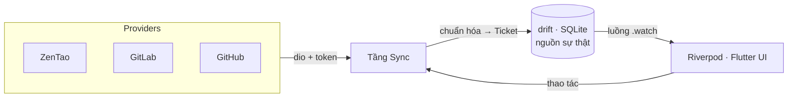

# WorkNexus

**Một bảng cho mọi ticket.** Không gian làm việc local-first dành cho lập trình viên,
gom bug, task, story, issue, merge/pull request từ **ZenTao, GitLab và GitHub** vào
một **Bảng công việc hợp nhất (Unified Task Board)** — kèm tính năng dịch tiếng Việt
tích hợp và giao một ticket cho coding agent chạy cục bộ (`claude`, `codex`,
`opencode`) chỉ với một cú nhấp.

<sub><a href="README.md">🇬🇧 English</a> · 🇻🇳 Tiếng Việt</sub>

> **Trạng thái:** đang phát triển giai đoạn đầu · desktop macOS · dự án nội bộ.
> Viết bằng Flutter/Dart theo Clean Architecture "feature-first".

---

## Vì sao có WorkNexus?

Các nhóm hiện đại thường phân tán công việc trên nhiều hệ thống theo dõi khác nhau.
WorkNexus gộp chúng lại thành một ứng dụng desktop thân thiện với bàn phím, để bạn
triage, lọc, dịch, bình luận và thao tác trên ticket mà không phải nhảy qua lại giữa
bốn giao diện web.

- **Local-first.** Cơ sở dữ liệu SQLite cục bộ (drift) là nguồn dữ liệu duy nhất. Giao
  diện luôn đọc từ DB và phản ứng theo thay đổi; quá trình sync ghi dữ liệu mạng vào
  DB, không bao giờ ghi thẳng lên màn hình. Mọi thứ luôn nhanh và dùng được offline sau
  khi đã sync.
- **Bảng làm việc không phụ thuộc provider.** Item của ZenTao, GitLab và GitHub được
  chuẩn hóa về cùng một mô hình `Ticket` và hiển thị cạnh nhau — dạng Kanban hoặc List.
- **An toàn mặc định.** Token của provider nằm trong macOS Keychain, không lưu dạng
  văn bản thô. Header xác thực được gắn theo từng host để token không rò rỉ sang host
  ảnh/CDN của bên thứ ba.

---

## Tính năng

### 📋 Bảng công việc hợp nhất
- Chế độ xem **Kanban** và **List** trên mô hình `Ticket` đã chuẩn hóa.
- Các chế độ bảng theo provider: ZenTao **Bug** / **Task**, GitLab **Issue** / **MR**,
  GitHub **Issue** / **PR**.
- **Bộ lọc theo ngữ cảnh** với mặc định hợp lý "**Ticket của tôi**", cùng các facet
  suy ra từ dữ liệu (người phụ trách, trạng thái, độ ưu tiên, nhãn…).
- Tab duyệt do máy chủ điều khiển cho bảng bug ZenTao (**All / Unclosed**).

### 🔌 Kết nối đa provider
| Provider | Xác thực | Loại item | Thao tác trong app |
|---|---|---|---|
| **ZenTao** *(ưu tiên)* | Token | Bug, Task (theo product / execution) | Resolve / activate bug, gán người, bình luận, ghim execution |
| **GitLab** | Personal Access Token | Issue, Merge Request | Close / reopen / merge, gán người |
| **GitHub** | Personal Access Token | Issue, Pull Request | Close / reopen / merge PR, gán người |

Hỗ trợ cả bản SaaS (`gitlab.com`, `github.com`) lẫn bản **self-hosted / Enterprise**.

### 🗂️ Bảng chi tiết Task (slide-over)
Một bảng tập trung với các tab: **Original · Translation · Comments · Activity ·
Development** — kèm xem trước ảnh/tệp đính kèm ngay trong app (ảnh chụp và video tái
hiện lỗi) được tải an toàn bằng token của bạn.

### 🌐 Dịch tiếng Việt (tích hợp)
Dịch mô tả và bình luận của ticket sang tiếng Việt qua backend **OpenCode** cục bộ
(`opencode serve`). Kết quả được cache với trạng thái rõ ràng —
*none / loading / done / outdated / error* — nên bạn không bao giờ phải dịch lại phần
văn bản không đổi.

### 🤖 Giao cho coding agent
Giao một ticket cho CLI agent cài sẵn trên máy — **`claude`**, **`codex`** hoặc
**`opencode`** — để bắt tay xử lý ngay từ bảng làm việc.

### 🎨 Hệ thống thiết kế "editorial"
- Ba bề mặt: **light editorial cream**, **dark**, **midnight**.
- Biến thể **flat / outline** × mật độ **comfortable / compact** × tùy chọn **tông màu
  nhấn theo công ty** × bo góc component điều chỉnh được.
- Bộ chữ đi kèm **Space Grotesk** + **Space Mono**.
- Giao diện đầy đủ **Tiếng Anh / Tiếng Việt** (l10n).

---

## Công nghệ sử dụng

| Mảng | Lựa chọn |
|---|---|
| Ngôn ngữ / UI | Flutter · Dart 3.10.7 (quản lý qua **fvm**) |
| Quản lý trạng thái | **Riverpod 3** (state bất biến bằng **freezed**) |
| Dependency injection | **get_it** + **injectable** (một composition root duy nhất) |
| CSDL cục bộ | **drift** (SQLite) — `.watch` phản ứng, là nguồn sự thật |
| Kết nối mạng | **dio** + **retrofit** (client REST ZenTao có kiểu chặt chẽ) |
| Xử lý lỗi | **fpdart** `Result` / `Failure` (không ném exception qua các tầng) |
| Bí mật | **flutter_secure_storage** (macOS Keychain) |
| Vỏ desktop | **window_manager** (thanh tiêu đề tùy biến) |
| Markdown / media | **gpt_markdown**, **cached_network_image**, **video_player** |

---

## Kiến trúc

WorkNexus theo **Clean Architecture feature-first**: mỗi tính năng là một lát cắt dọc
gồm `domain → data → presentation`, phụ thuộc chỉ hướng vào trong, và tầng `domain` là
Dart thuần. Bộ quy tắc đầy đủ (được thực thi) nằm ở [`AGENTS.md`](AGENTS.md) /
[`CLAUDE.md`](CLAUDE.md).



```
lib/
├── app/                 # Widget gốc + app shell
├── core/                # Shared kernel: theme, widgets, error, di, database, util…
├── features/
│   ├── agents/          # Giao ticket cho CLI coding agent
│   ├── board/           # Bảng công việc hợp nhất (domain + presentation)
│   ├── connections/     # Thiết lập provider: ZenTao / GitLab / GitHub
│   ├── sync/            # Đồng bộ mạng → drift
│   ├── task_detail/     # Bảng chi tiết Task (slide-over)
│   └── translation/     # Dịch VI qua OpenCode
└── l10n/                # Bản địa hóa EN / VI
```

---

## Bắt đầu

### Yêu cầu
- **[fvm](https://fvm.app/)** (toolchain đã ghim; lệnh chạy dạng `fvm flutter` /
  `fvm dart`) với **Flutter 3.38.8 / Dart 3.10.7**.
- **macOS** kèm Xcode command-line tools (nền tảng desktop hiện tại).
- Tùy chọn, cho các tính năng tương ứng:
  - **OpenCode** trong `PATH` (dịch tiếng Việt).
  - CLI `claude` / `codex` / `opencode` trong `PATH` (giao cho coding agent).

### Cài đặt

```bash
# 1. Cài dependencies
make get            # → fvm flutter pub get

# 2. Sinh code (freezed / json / drift / retrofit / injectable)
make codegen        # → build_runner build --delete-conflicting-outputs

# 3. Chạy app trên macOS
make run            # → fvm flutter run -d macos
```

Sau đó mở **Settings → Integrations** trong app để kết nối một provider (token ZenTao,
hoặc Personal Access Token của GitLab/GitHub) và sync bảng đầu tiên.

### Lưu ý cho macOS
- App sandbox được **tắt** có chủ đích để app có thể khởi chạy CLI agent cục bộ và truy
  cập `localhost` (máy chủ OpenCode). Token được lưu ở **login keychain** (không cần
  entitlement đặc biệt).
- Để truy cập Keychain ổn định qua các lần build lại, thêm file cục bộ
  `macos/Runner/Configs/Signing.xcconfig` (xem `Signing.xcconfig.example`). Thiếu file
  này thì build sẽ quay về ký ad-hoc.

---

## Các lệnh Make

| Lệnh | Chức năng |
|---|---|
| `make get` | Cài dependencies |
| `make codegen` | Chạy toàn bộ code generator một lần |
| `make watch` | Theo dõi & sinh lại code |
| `make run` | Chạy app (`DEVICE=macos` mặc định) |
| `make format` | Format `lib` + `test` |
| `make analyze` | Phân tích tĩnh |
| `make test` | Chạy test (`TEST=đường/dẫn/hoặc/tên` để chạy một phần) |
| `make verify` | `format` + `analyze` + `test` |
| `make build-macos-release` | Build bản release cho macOS |
| `make reset` | Dọn sạch, cài lại deps, sinh lại code |

Chạy `make help` để xem tất cả.

---

## Kiểm thử

Logic domain (entity, value object, use case) test được mà không cần Flutter; ranh giới
data được mock bằng **mocktail**, còn repository được test trên drift chạy trong bộ nhớ.

```bash
make test                                   # toàn bộ
make test TEST=test/data/zentao_normalize_test.dart   # một file
```

---

## Lộ trình

- [x] Provider ZenTao (bug + task)
- [x] Provider GitLab (issue + merge request)
- [x] Provider GitHub (issue + pull request)
- [x] Dịch tiếng Việt qua OpenCode
- [x] Giao ticket cho coding agent
- [ ] Đẩy bình luận ngược về provider
- [ ] Thêm provider khác (ví dụ Jira)
- [ ] Client iOS / Android
- [ ] Tách sync client ↔ server

---

## Giấy phép

Dự án nội bộ — © 2026 com.worknexus. Bảo lưu mọi quyền.
