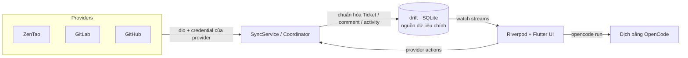

# WorkNexus

**Một nơi để đọc và xử lý mọi ticket.** WorkNexus là workspace desktop local-first,
dành cho developer phải theo dõi công việc ở nhiều
nguồn như **ZenTao, GitLab và GitHub**. App đồng bộ dữ liệu về SQLite cục bộ,
chuẩn hóa thành `Ticket`, rồi hiển thị theo đúng luồng làm việc của từng nguồn:
bug/task ZenTao, issue/MR GitLab, issue/PR GitHub.

<sub><a href="README.md">🇬🇧 English</a> · 🇻🇳 Tiếng Việt</sub>

> **Trạng thái:** đang phát triển giai đoạn đầu · desktop Windows/macOS · dự án nội bộ.
> Viết bằng Flutter/Dart theo Clean Architecture feature-first.

---

## Bảng phong thần

Vinh danh những người có code đã được merge vào `main`. 🏆

| | Contributor | Đóng góp nổi bật |
|:-:|---|---|
| <a href="https://github.com/thanhnguyen293"></a> | **[Thanh Nguyen](https://github.com/thanhnguyen293)** | 🥇 Người khởi tạo & maintainer — kiến trúc, providers, board, task detail, ZenTao chat |
| <a href="https://github.com/dyno-nexsoft"></a> | **[Dyno (dyno-nexsoft)](https://github.com/dyno-nexsoft)** | 🥈 Updater trong app, dịch bằng API key, CI release & bộ cài đặt (cả AppImage cho Linux), khung soạn chat Quill, board ZenTao phân trang, mini app, tên & biểu tượng app tuỳ chọn |
| <a href="https://github.com/phungbuuquang"></a> | **[Michael (phungbuuquang)](https://github.com/phungbuuquang)** | 🥉 Menu tray desktop, hoàn thiện cửa sổ & profile (Windows/macOS) |
| <a href="https://github.com/baby-hero-404"></a> | **[baby-hero (baby-hero-404)](https://github.com/baby-hero-404)** | 🏅 Kiến trúc tool module (registry `ToolModule`) và rework workspace shell — rail, nav pane, trang tổng quan workspace |

<a href="https://github.com/thanhnguyen293/WorkNexus/graphs/contributors">
  
</a>

---

## Vì sao có WorkNexus?

Công việc thường nằm rải rác ở nhiều hệ thống quản lý khác nhau. WorkNexus gom
việc đọc ticket, lọc, triage, bình luận, thao tác với provider, xem tệp đính kèm
và dịch máy vào một giao diện desktop duy nhất, để bạn không phải liên tục đổi
qua lại giữa nhiều tab trình duyệt.

- **Local-first.** drift/SQLite là nguồn dữ liệu chính. Sync ghi dữ liệu mạng
  vào CSDL; UI Flutter đọc stream reactive từ CSDL, nên ticket đã được cache vẫn
  xem được khi offline.
- **Thống nhất nhưng không đánh đồng.** Mọi nguồn đều được chuẩn hóa thành
  `Ticket`, nhưng từng bảng vẫn giữ vòng đời và action riêng của provider thay
  vì ép tất cả vào một bộ trạng thái chung.
- **An toàn mặc định.** Thông tin đăng nhập được lưu bằng
  `flutter_secure_storage` (macOS Keychain). Khi tải ảnh/tệp đính kèm cần xác
  thực, token chỉ được gắn với host của provider, không gửi sang host asset/CDN
  bên thứ ba.

---

## Trải nghiệm giao diện & Kiến trúc điều hướng

Workspace shell xếp mọi công cụ vào 5 cấp:
`Workspace (L1) → Tài khoản (L2) → Section (L3) → Scope (L4) → Item (L5)`.
Rail chọn workspace hoặc một tài khoản trong đó, nav pane chọn section và scope (một
project, product hay repository), viewport hiển thị section đó, và ticket mở trong
detail slide-over.

> Ảnh chụp app hiện tại sẽ được bổ sung; các mockup thiết kế trước đây đã được bỏ vì
> không còn khớp với app.

### Giải phẫu cửa sổ desktop

Trang tổng quan workspace đúng như app hiển thị (theme tối, macOS):

```text
┌────────────────────────────────────────────────────────────────────────────────────────┐
│ • • •  [W] MyWorkspace ▾ / Overview      [ Search tasks, bugs, PRs, MRs…  Cmd+K ]  [⚙] │
├──────────┬───────────────────────────┬─────────────────────────────────────────────────┤
│ Workspace│ WORKSPACE / MYWORKSPACE   │ Overview                   Manage integrations  │
│ ──────── │ > Overview                │ ┌ GitHub ─────┐ ┌ ZenTao ─────┐ ┌ GitLab ─────┐ │
│ ZenTao   │   Integrations         3  │ │ PRs  Issues │ │ Tasks  Bugs │ │ Projs  MRs  │ │
│ GitHub   │   Members                 │ │ [Open →]    │ │ [Open →]    │ │ [Open →]    │ │
│ GitLab   │   Settings                │ └─────────────┘ └─────────────┘ └─────────────┘ │
│ ──────── │                           │ ┌ ZenTao · account ───────────────────────────┐ │
│ Zentao   │                           │ │ My tasks              │ My bugs             │ │
│ Trello   │                           │ │ Executions            │ Recent activity     │ │
│ CI/CD    │                           │ └─────────────────────────────────────────────┘ │
│ + Add    │                           │ ┌ Assigned to you · from all tools ───────────┐ │
│ ──────── │                           │ │ BUG-…   …                         confirmed │ │
│ Bell     │                           │ │ TASK-…  …                         wait      │ │
│ Update   │                           │ └─────────────────────────────────────────────┘ │
│ + Connect│                           │                                                 │
└──────────┴───────────────────────────┴─────────────────────────────────────────────────┘
  76px rail  300px nav pane                viewport   ◄── 460px detail slide-over (a ticket)
```

| Vùng | Kích thước | Chứa gì |
|---|---|---|
| **Title bar** | `52pt` trên macOS (đèn giao thông căn giữa trong đó) · `56px` trên Windows/Linux (kèm nút cửa sổ) | Bộ chọn workspace và breadcrumb (`Workspace ▾ / Tài khoản / Section / Scope`), **tìm kiếm theo ngữ cảnh** (`Ctrl/Cmd+K`) với placeholder đổi theo vị trí hiện tại, và nút **Cài đặt nhanh**. |
| **Rail** | `76px` | **Workspace** (`Ctrl/Cmd+1`), rồi một nút cho mỗi tài khoản đã kết nối (`Ctrl/Cmd+2…9`) kèm số tin chat chưa đọc; các **mini app** cùng nút **+ Thêm**; dưới cùng là **Thông báo**, nút **cập nhật** (khi có bản mới) và **+ Kết nối**. |
| **Nav pane** | `300px` | Trong workspace: *Overview*, *Integrations*, *Members*, *Settings*. Trong một công cụ: các tab section và danh sách scope — ô lọc, scope đã ghim và gần đây, cây project/product (ZenTao) hoặc repository (GitHub/GitLab). Ẩn đi khi mini app hoặc trình soạn ticket chiếm cả cửa sổ. |
| **Viewport** | co giãn | Chính section đó với các view mode; 3 section gần nhất được giữ sống (LRU) để quay lại tức thì. |
| **Detail slide-over** | `460px` | Trượt ra từ bên phải khi mở ticket: nút thao tác ở header, mô tả với **Bản gốc / Bản dịch**, bình luận và timeline, cùng lịch sử các ticket đã mở. |
| **Panel bên** | phủ lên | **Thông báo** trượt ra cạnh rail; **Cài đặt nhanh** (giao diện, bố cục, chat, cache) từ bên phải. |

### Section của từng công cụ

| Công cụ | Section (L3) | Scope (L4) | View mode |
|---|---|---|---|
| **Workspace** | Overview · Integrations · Members · Settings | — | Overview: thẻ công cụ, khu ZenTao (*My tasks*, *My bugs*, *Executions*, *Recent activity*) và **Assigned to you** từ mọi công cụ |
| **ZenTao** | Chat · Tasks · Bugs (Docs, Executions: đã có trong danh sách, chưa làm) | hội thoại · project/execution · product | Tasks: List, Kanban (Calendar và Gantt đang là placeholder) · Bugs: Board, List |
| **GitHub** | Pull requests · Issues (Actions: chưa làm) | repository | PR: Open, Merged, Closed, Board · Issues: List, Board |
| **GitLab** | Merge requests · Issues (Pipelines: chưa làm) | project | MR: Open, Merged, Closed, Board · Issues: List, Board |

Ngoài ra trong shell:

- **Mini app** — website bất kỳ ghim vào rail và hiển thị ngay trong app; link
  từ chat, ticket và các trang khác được chuyển tới đúng mini app (xem
  [Mini app](#mini-app)).
- **Tên và biểu tượng riêng** — tiêu đề cửa sổ, taskbar/Alt-Tab và khay hệ
  thống dùng tên và (trên Windows) ảnh bạn chọn trong Cài đặt nhanh › Giao diện.

---

## Tính năng

### Unified workspace shell (Shell không gian làm việc thống nhất)

- **Điều hướng 5 cấp:** Title bar → Rail tài khoản → Nav pane của công cụ → Viewport section → Detail slide-over.
- **Rail theo từng tài khoản** với màu nhận diện của provider; phím tắt `Ctrl/Cmd+1…9` để chuyển đổi nhanh.
- **Các section cấp workspace:** Overview (lưới thẻ + công việc được giao), Integrations (trạng thái sync + Quản lý), Members (sắp ra mắt), Settings.
- **Thẻ tổng quan (Overview cards)** hiển thị số liệu theo từng tài khoản (đang mở, được giao, lần sync cuối) kèm hiệu ứng skeleton loading.
- **Danh sách "Assigned to you"** tổng hợp công việc từ tất cả tài khoản trong workspace với chip lý do thông minh (reviewer, assignee).
- **Trình chuyển workspace** dạng popover với tìm kiếm, điều hướng bàn phím và thao tác "Tạo workspace".
- **Tìm kiếm theo ngữ cảnh** (`Ctrl/Cmd+K`): tìm kiếm ticket cục bộ có xếp hạng trọng số (tiêu đề/mã số/mô tả) cùng overlay kết quả điều hướng bàn phím.
- **Lưu trạng thái liên tục:** vị trí điều hướng của từng workspace (section, scope, view mode) được tự động lưu lại và phục hồi khi mở lại app hoặc chuyển workspace.
- **Bộ nhớ đệm section (Section caching):** viewport giữ 3 section gần nhất ở trạng thái ẩn (tạm dừng ticker/focus) để chuyển đổi tức thì.
- **Bảo vệ lỗi (Error boundary):** mỗi section được bọc bởi `SectionErrorBoundary` giúp bắt lỗi render và hiển thị nút thử lại thay vì làm sập ứng dụng.

### Bảng công việc và section riêng theo từng công cụ

- **ZenTao** — Chat, Tasks (List / Kanban / Calendar† / Gantt†), Bugs (Board / List), Docs†, Sprints†.
- **GitLab** — Merge Requests (Open / Merged / Closed / Board), Issues (List / Board), Pipelines†.
- **GitHub** — Pull Requests (Open / Merged / Closed / Board), Issues (List / Board), Actions†.
- † = các section dự kiến, render dưới dạng `ComingSoonView` kèm nút "Chuyển sang…".
- Phạm vi (Scope): project, product hoặc repository với thứ tự ưu tiên ghim đầu và lịch sử gần đây.
- Cột theo vòng đời thật của từng provider:
  - ZenTao bug: new/unconfirmed, confirmed/to-fix, resolved/verify,
    postponed, non-fix, closed.
  - ZenTao task: not started, in progress, paused, done/verify, closed,
    canceled.
  - GitLab/GitHub issue: open, in progress, closed.
  - GitLab/GitHub MR/PR: draft, review, merged, closed.
- Bộ lọc theo ngữ cảnh, với các nhóm lọc được suy ra từ dữ liệu: workspace,
  provider, account, người phụ trách, trạng thái, độ ưu tiên, label và tìm kiếm.
- Mỗi tab/project/repo dùng dữ liệu từ server nhưng có fallback offline: nếu
  không refresh được, app vẫn render ticket đã cache từ CSDL cục bộ.
- Cột phân trang dọn ticket cache mà server không còn liệt kê khi các trang
  tải về, nhưng giữ lại ticket của cột mà các trang đã tải chưa chạm tới
  (Postponed và Non-Fix dùng chung view `toclosed` của ZenTao với Resolved),
  nên thẻ của chúng không biến mất sau khi refresh.

### Kết nối nhiều provider

| Nguồn | Xác thực | Dữ liệu / phạm vi | Thao tác trong app |
|---|---|---|---|
| **ZenTao** | Tài khoản/mật khẩu trong Keychain; app lấy v1 session token | Bug theo product, task theo execution | Bình luận, note nội bộ, gán người, confirm/resolve/activate bug, ghim product/execution |
| **GitLab** | Personal Access Token | Issue, merge request, thành viên project, label, milestone, commit/changed file của MR | Bình luận, note nội bộ, gán người, đóng/mở lại, request reviewer, approve/rebase/merge MR, sửa label/milestone/time tracking |
| **GitHub** | Personal Access Token | Issue, pull request, assignee/reviewer của repo, commit/file của PR | Bình luận, note nội bộ, gán người, đóng/mở lại, request reviewer, update branch, merge PR |

GitLab hỗ trợ cả `gitlab.com` và instance self-hosted. GitHub hỗ trợ
`github.com` và GitHub Enterprise Server. Jira hiện mới là placeholder trong UI
và asset; chưa có adapter Jira.

### Mini app

- Ghim website bất kỳ vào rail thành **mini app** — Figma, Trello, giao diện web
  ZenTao, công cụ nội bộ — với icon của trang hoặc ảnh tự chọn, và tên tùy ý.
- Mỗi mini app là một web view nhúng (WebView2 trên Windows, WKWebView trên
  macOS) có back/forward, reload, stop, mở bằng trình duyệt và các phím tắt
  quen thuộc; cửa sổ pop-up của trang (cửa sổ đăng nhập) mở đè lên ngay trong
  app.
- Hỏi quyền theo từng trang — thông báo, camera, micro, vị trí, clipboard,
  autoplay, tải nhiều file, font cục bộ — được nhớ theo từng mini app và chỉnh
  lại được trong cài đặt. Thông báo của trang thành thông báo hệ điều hành, bấm
  vào sẽ quay lại đúng trang đó.
- **Link đi theo một thứ tự chung:** link bấm trong chat, trong ticket, hay do
  trang mở (`target=_blank`, `window.open`) được app nhận trước (ticket ZenTao
  mở trong panel chi tiết), sau đó tới mini app của trang đó (link Figma từ
  Trello đưa mini app Figma lên), cuối cùng mới tới trình duyệt hoặc pop-up của
  trang. Link tới chính trang của mini app vẫn ở trong cửa sổ của nó.
- **Đăng nhập ZenTao:** mini app trỏ tới server ZenTao đã kết nối sẽ tự đăng
  nhập bằng tài khoản đã lưu. Mật khẩu chỉ được đưa cho trang đăng nhập của
  chính server đó (cùng scheme, host và port) và chỉ điền vào form
  account/password; form chỉ được gửi một lần mỗi lần mở trang — sai mật khẩu
  thì không thử lại, và vẫn đăng xuất được.

### Chi tiết ticket và màn hình review

- Panel chi tiết dạng slide-over với các tab **Original**, ngôn ngữ dịch đang
  chọn, và **Comments & Activity**.
- Hai kiểu layout chi tiết: two-pane có sidebar metadata, hoặc document layout
  một cột để đọc nội dung dài.
- Comment từ provider và note nội bộ được hiển thị chung trong một timeline.
- Tải ảnh inline an toàn và preview attachment cho screenshot/video tái hiện lỗi.
- GitLab MR và GitHub PR có view riêng: overview, khung bình luận trong
  timeline, commit, changed files, trạng thái merge và trình sửa metadata.

### Dịch máy bằng OpenCode

- Dùng **OpenCode CLI** cục bộ qua `opencode run`; cần đăng nhập OpenCode bằng
  `opencode auth login`.
- Ngôn ngữ đích mặc định là tiếng Việt; có thể chọn thêm English, Japanese,
  Chinese (Simplified) và Korean.
- Bản dịch được cache theo ticket, ngôn ngữ đích, source hash và phiên bản
  prompt template.
- Trạng thái rõ ràng: `none`, `loading`, `done`, `outdated`, `error`.
- Prompt yêu cầu giữ nguyên code, định danh, đường dẫn file, URL và Markdown.

### Giao diện và workflow

- UI hỗ trợ đầy đủ tiếng Anh và tiếng Việt.
- Quick settings cho ngôn ngữ UI, ngôn ngữ dịch, theme, kiểu surface, mật độ
  hiển thị, layout chi tiết, định dạng ngày, font, màu accent và bo góc
  component.
- Theme: light, dark và midnight.
- Surface: flat hoặc outline; density: comfortable hoặc compact.
- Font mặc định: **Be Vietnam Pro** qua `google_fonts`.
- Font đi kèm: **Space Grotesk** và **Space Mono**; có thêm font hệ thống và
  **Geist Mono** để chọn.
- Độ rộng sidebar kéo chỉnh được và được lưu lại trong drift.
- **Tên và biểu tượng app:** đặt tên riêng cho app (tiêu đề cửa sổ, khi rê
  chuột trên taskbar, Alt-Tab, tooltip ở khay hệ thống) và, trên Windows, chọn
  ảnh bất kỳ — hoặc khung lớn nhất của file `.ico` nhiều kích thước — làm
  biểu tượng cửa sổ, taskbar và khay. Cả hai được giữ qua các lần mở app và có
  thể đặt lại mặc định. Biểu tượng và tên của chính file `.exe` (Explorer,
  Start menu, Task Manager, shortcut đã ghim) và tên trên thông báo hệ thống
  được cố định lúc build.

### Gửi ticket cho coding-agent (thử nghiệm)

Repo đã có phần thử nghiệm cho tab Development để gửi ticket sang **Claude
Code**, **Codex** hoặc **OpenCode**. Mặc định app chạy dry-run bằng mock session;
khi bật live CLI, app dùng binary cài trên máy và stream event đã chuẩn hóa vào
session store in-memory. Luồng này vẫn đang thử nghiệm và chưa nằm trong tab
strip mặc định của panel chi tiết.

---

## Công nghệ

| Mảng | Lựa chọn |
|---|---|
| Ngôn ngữ / UI | Flutter 3.44.8 · Dart 3.12.2 (qua **fvm**) |
| State management | **Riverpod 3** với state bất biến bằng **freezed** |
| Dependency injection | **get_it** + **injectable** trong một composition root |
| CSDL cục bộ | **drift** / SQLite với stream `.watch()` reactive |
| Kết nối mạng | **dio** + **retrofit** cho REST client có type rõ ràng |
| Xử lý lỗi | **fpdart** `Result` / `Failure`; không ném exception qua ranh giới layer |
| Secrets | **flutter_secure_storage** dùng macOS Keychain |
| Desktop shell | **window_manager** với custom title bar |
| UI / media | **gpt_markdown**, **flutter_svg**, **cached_network_image**, **video_player**, **image_picker**, **google_fonts** |
| Log / diagnostics | **talker_flutter**, **talker_dio_logger**, **logger** |
| Codegen | **build_runner**, **freezed**, **json_serializable**, **drift_dev**, **retrofit_generator**, **injectable_generator**, **flutter_gen** |

---

## Kiến trúc

WorkNexus đi theo **Clean Architecture feature-first**: mỗi feature là một lát
cắt dọc gồm `domain -> data -> presentation`, dependency chỉ hướng vào trong, và
domain là Dart thuần. Composition root duy nhất nằm ở `lib/app/di/`.
Bộ quy tắc đầy đủ nằm trong [`AGENTS.md`](AGENTS.md) / [`CLAUDE.md`](CLAUDE.md).

### Cấu trúc phân cấp của Shell

```
┌─────────────────────────────────────────────────────┐
│  Title Bar (breadcrumb · tìm kiếm · settings)       │
├────┬────────────┬───────────────────────┬────────────┤
│Rail│  Nav Pane   │       Viewport        │  Detail    │
│    │ (workspace  │  (nội dung section    │  slide-    │
│    │  hoặc tool) │   cùng các view mode) │  over      │
└────┴────────────┴───────────────────────┴────────────┘
```

**Rail** hiển thị một icon cho mỗi tài khoản được kết nối trong workspace đang chọn.
Nhấp vào tài khoản sẽ chuyển **nav pane** từ các mục workspace sang pane riêng của
module công cụ đó (danh sách scope, các tab section). Mỗi **tool module**
triển khai `ToolModule` và đăng ký trong `app/tool_registry.dart`.


```mermaid
flowchart LR
    subgraph Providers
        Z[ZenTao] & GL[GitLab] & GH[GitHub]
    end
    Providers -->|dio + credential của provider| SYNC[SyncService / Coordinator]
    SYNC -->|chuẩn hóa Ticket / comment / activity| DB[(drift · SQLite<br/>nguồn dữ liệu chính)]
    DB -->|watch streams| UI[Riverpod + Flutter UI]
    UI -->|provider actions| SYNC
    UI -->|opencode run| TR[Dịch bằng OpenCode]
```

```
lib/
├── app/                 # Composition root (di/), shell (rail, viewport, title bar),
│                        #   navigation và tool registry
├── core/                # Shared kernel: theme, widgets, error, database, cache, platform
├── shared/              # Shared slices: board, detail, shell_pane, sync
├── tools/               # Provider tool modules: zentao, gitlab, github (implement ToolModule)
├── features/            # Feature slices: chat, translation, app_update,
│                        #   connections, notifications, workspace_overview
├── gen/                 # Asset accessor sinh tự động
└── l10n/                # ARB tiếng Anh/Việt và l10n sinh tự động
```

---

## Bắt đầu

### Yêu cầu

- **[fvm](https://fvm.app/)** với Flutter **3.44.8** / Dart **3.12.2**.
- **macOS** kèm Xcode command-line tools (desktop target chính).
- Thông tin đăng nhập cho provider:
  - ZenTao: server URL, account và mật khẩu.
  - GitLab: Personal Access Token, thường cần scope `api`.
  - GitHub: Personal Access Token có quyền đọc/thao tác với repo/org cần dùng.
- Tùy chọn:
  - `opencode` đã đăng nhập bằng `opencode auth login` để dùng dịch máy.
  - `claude`, `codex` hoặc `opencode` trong `PATH` nếu muốn thử live agent
    dispatch.

### Cài đặt

```bash
# 1. Cài dependency
make get

# 2. Sinh output cho freezed/json/drift/retrofit/injectable/flutter_gen
make codegen

# 3. Chạy app trên macOS
make run
```

Sau đó mở **Settings -> Integrations** trong app, kết nối tài khoản provider và
chọn một nguồn ở sidebar.

### Lưu ý trên macOS

- Sandbox của app macOS được tắt có chủ đích để WorkNexus có thể chạy CLI cục bộ
  và truy cập các process OpenCode/agent chạy local.
- Thông tin đăng nhập được lưu trong login Keychain, không lưu trong CSDL cục bộ.
- Để Keychain ổn định qua các lần rebuild, tạo file local
  `macos/Runner/Configs/Signing.xcconfig` dựa trên
  `macos/Runner/Configs/Signing.xcconfig.example`. Nếu thiếu file này, build sẽ
  quay về ad-hoc signing.

---

## Lệnh Make

| Lệnh | Chức năng |
|---|---|
| `make doctor` | Xem diagnostics của Flutter |
| `make get` | Cài dependency Dart/Flutter |
| `make outdated` | Xem thông tin package có thể nâng cấp |
| `make codegen` | Chạy toàn bộ code generator một lần |
| `make watch` | Theo dõi và sinh lại generated source Dart |
| `make run` | Chạy app (`DEVICE=macos` mặc định) |
| `make format` | Format `lib` và `test` |
| `make analyze` | Chạy static analysis |
| `make test` | Chạy test (`TEST=đường/dẫn/hoặc/tên` để chạy một phần) |
| `make verify` | Chạy `format`, `analyze` và `test` |
| `make build-macos` | Build app macOS |
| `make build-macos-release` | Build bản release cho macOS |
| `make build-windows-release` | Build target release cho Windows |
| `make build-linux-release` | Build target release cho Linux |
| `make clean` | Dọn output build của Flutter |
| `make reset` | Clean, cài lại dependency và sinh lại code |

Chạy `make help` để xem danh sách target hiện tại.

---

## Kiểm thử

Test suite bao quát máy trạng thái điều hướng, bộ nhớ đệm section, error boundary,
tích hợp shell (khởi chạy → tổng quan → tài khoản → khôi phục trạng thái), logic board ở domain,
chuẩn hoá/adapter của provider, repository và migration drift, cache, theme extension,
quick settings, provider badge, dialog kết nối, detail view cho MR/PR, xếp hạng tìm kiếm và state bản dịch.

```bash
make test
make test TEST=test/core/app_nav_controller_test.dart
make test TEST=test/widget/shell_integration_test.dart
make test TEST=test/architecture/import_rules_test.dart
```

---

## Lộ trình

- [x] Provider ZenTao: bug theo product, task theo execution.
- [x] Provider GitLab: issue/MR, project board và My MRs.
- [x] Provider GitHub: issue/PR, repo board và My PRs.
- [x] Comment lên provider và note nội bộ chỉ lưu local.
- [x] Dịch máy bằng OpenCode với nhiều ngôn ngữ đích.
- [x] Detail view cho GitLab/GitHub MR/PR với commit, changed files và merge
  action.
- [x] **Unified workspace shell** với rail theo tài khoản, lưu vị trí điều hướng,
  cache section, tìm kiếm theo ngữ cảnh và error boundary.
- [x] Tổng quan workspace (Overview) với bảng tổng hợp công việc được giao và thẻ trạng thái sync.
- [ ] Đưa luồng Development/coding-agent ra UI chính và polish thêm.
- [ ] Lưu bền vững dev link và agent session thay vì chỉ giữ in-memory.
- [ ] Adapter Jira.
- [ ] Trạng thái kiểm tra CI của GitHub và cột approval/pipeline của GitLab.
- [ ] Các section Sprint, Docs, Calendar và Gantt cho ZenTao.
- [ ] Layout màn hình nhỏ (pass responsive <1024px).
- [ ] Kiểm chứng desktop target Windows/Linux.
- [ ] Tách sync client/server và client mobile.

---

## Giấy phép

Dự án nội bộ — © 2026 com.worknexus. Bảo lưu mọi quyền.
